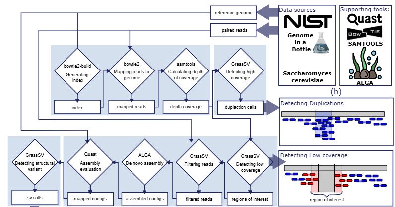
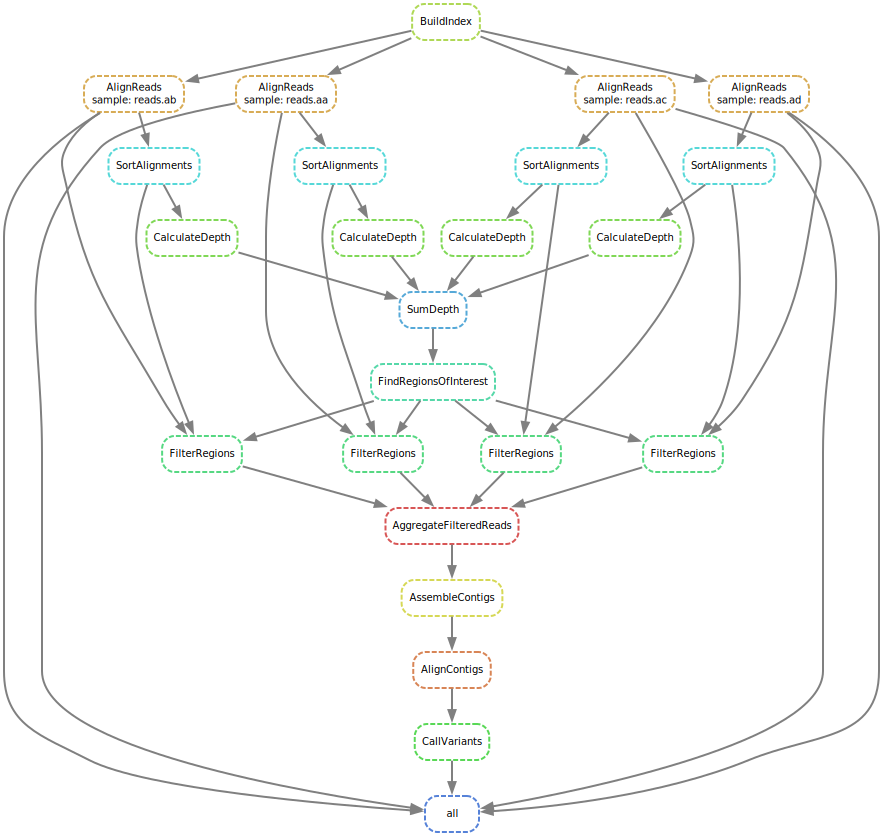

# Brief summary:
GrassSV is a tool (+ a pipeline) used to call structural variants. It comes shipped with all requried tools defined inside **apptainer** definiton. The data processing pipeline is easily reproductible using **snakemake**. The tool was tested in **HPC** servers with **SLURM** resource manager. For sv calling of **whole human genome**, substantial resources are required (~250GB RAM at peak). **Smaller genomes** like yeast/bacteria can be run on **personal computers**.

# GrassSV
GrassSV is a command-line interface (CLI) tool used for detecting structural variants in genomic data. GrassSV is shipped along with a unique pipeline, that substantially narrows down the amount of read pairs required in de-novo assembly, on which the main SV detection engine is based on.  
```
usage: GrassSV.py [-h] {rsvsim2bed,find_sv,find_roi,roi_statistics,quast2bed,
                         filter_reads,slurm_dispatch,find_hdr,run_standalone,utils} ...

positional arguments:
  {rsvsim2bed,find_sv,find_roi,roi_statistics,quast2bed,filter_reads,slurm_dispatch,find_hdr,run_standalone,
  utils}
                        GrassSV consits of multiple scripts:
    rsvsim2bed          converts sequences from rsvsims's csv format to bed
    find_sv             finds structural variations based on contig's alignments
    find_roi            finds regions of intrest based on mapping coverage
    roi_statistics      confronts found regions with generated mutations
    quast2bed           converts sequences from quast tsv format to bed
    filter_reads        Filters reads by regions of interest
    find_hdr            finds regions of high depth coverage
    utils               Utilities [csv2bed, sv_check]
```
<p align="center">
The below diagram illustrates the idea standing behind GrassSV redcution of assembled paired reads.
</p>

<p align="center">
  
</p>

# Prerequsites 
We recomend to install snakemake via conda package manager.
## Install a conda package manager
Any conda envirment will do - you can install miniforge with the following commands:

`wget "https://github.com/conda-forge/miniforge/releases/latest/download/Miniforge3-$(uname)-$(uname -m).sh" miniforge_installer.sh`

`bash miniforge_installer.sh -b -p $HOME`

## Create a conda enviroment to run snakemake
```
conda create -c conda-forge -c bioconda -n snakemake snakemake
conda activate snakemake
conda install snakemake-executor-plugin-slurm
conda install snakemake-executor-generic-slurm
```
## Install apptainer
For HPC - apptainer should be already installed by your server administrator. On personal PC you can install it through your OS packagae manager. 

On ubuntu: `sudo apt install -y apptainer`


# Reproductible execution enviroments:
```
workflow
├── envs
│   ├── ALGA
│   │   └── alga.def
│   ├── GrassSV
│   │   └── grasssv.def
│   ├── bowtie2
│   │   └── bowtie2.def
│   ├── quast
│   │   └── quast.def
│   └── samtools
│       └── samtools.def
```
Each of required tools comes with a predefined **apptainer** container definition that can be built by issuing `sudo singularity-build <xx>.sif <xx>.def` or `apptainer build <xx>.sif <xx>.def` depending on your apptainer/singularity version.

Here is a one liner loop to install all the enviroments - run it from repository root directory:

using singularity-build:
``(cd workflow/envs; for dir in bowtie2/bowtie2 quast/quast ALGA/alga GrassSV/grasssv samtools/samtools; do (d=$(dirname $dir); b=$(basename $dir); cd $d; yes | sudo singularity-build --force $b.sif $b.def); done
)``

using apptainer build:
``(cd workflow/envs; for dir in bowtie2/bowtie2 quast/quast ALGA/alga GrassSV/grasssv samtools/samtools; do (d=$(dirname $dir); b=$(basename $dir); cd $d; yes | sudo apptainer build $b.sif $b.def); done
)``


# Reproductible pipelines using snakemake

You can deploy full GrassSV pipeline easily using snakemake - a workflow management system to create reproducible and scalable data analyses.
Our pipeline uses **apptainer** contenerization to faciliate dependency instalation on your system. Use of contenerization is **recommended**, but dependencies can be also satisifed by manual instalation / usage of conda or usage of your hpc resource manager module loader.



The above diagram illustrates the workflow of the GrassSV pipeline - with 4 pair end reads batches provied as an input.

The snakemake pipeline is run from withing GrassSV main repository folder using command:

`snakemake --configfile config.yaml --profile profile_dir/`

- **config.yaml** - [**REQUIRED**] should point to config defining your exact pipeline run (schema in next section)
- **profile_dir/** - [**OPTIONAL**] points to your platform configuration specific to your enviroment specification  

Here is the list of available profiles :
```
#For hpc try
--profile workflow/profile.slurm.apptainer.generic/   (uses generic executor plugin)
--profile workflow/profile.slurm.apptainer/           (uses slurm executor plugin)

#For desktop try
--sdm apptainer --cores 8 --jobs 8                    (uses apptainer, but no slurm)
```

*To run the pipeline on any other enviroment:*

- *research the required snakemake profile configuration for your platform and pass it into snakemake.*

**Additionally** you can enable **measuring time and resource** usage for each step by adding `--config use-time=True` to your snakemake execution command.

GrassSV pipeline was tested with slurm resource manager, and raw linux enviroment. In case of any troubles running GrassSV - contact, me at dominik.piotr.witczak@gmail.com or through this repository.

# Example run configuration file
```
run:
  name: "example"
  description: "Example GrassSV pipeline run configuration - fill in the values"
  version: "0.1.0"
  date: "2025-04-23"
  projectdir: "<projectdir>"
  genome:  "<path>/ref.fastq"
  input:   "<path-with-reads.fastq>"
  workdir: "<ex.scratch-dir>/runs/grasssv"
  logs:    "<workdir>/runs/grasssv"
  results: "<workdir>/runs/grasssv/"
```
- **project_dir** being the common dir parent of all the paths specified below.
- **genome** - path to the genome file
- **input** - path to file containg paired end files acceptable formats are XXX(.1|_1|.forward|_forward").fastq and XXX(.2|_2|.reverse|_reverse").fastq
- **workdir** - *path** where the intermediate files will be stored. 
- **logs** - *path** to store the log files, Grass SV logs:
    - timing measurements of each step using /usr/bin/time
    - stdout and stderr of each underlying program
    - errors produced by slurm resource manager 
- **results** - *path** where the final sv calls will be saved

**\* specified paths** create an additional directory on top with the name matching run **name** value. Ex.
```
name: "sacharomyces_test_a"
workdir: scratch-data/runs
```
Will result in intermediate files being saved in "scratch-data/runs/sacharomyces_test_a"

# Run GrassSV on benchmarking data
Benchmarking data is available in `benchmark` subdirectory of this repository. To run the benchmark on your PC try:
```
conda activate snakemake
snakemake --configfile workflow/benchmark.yaml --sdm apptainer --cores 8 --jobs 8
```
or if using slurm:
```
conda activate snakemake
snakemake --configfile workflow/benchmark.yaml --profile workflow/slurm.apptainer.generic
```


# Running specific GrassSV manually:

To detect structural variants (SVs) using GrassSV, follow these steps:

1. Map your reads to the reference genome and calculate the depth of coverage.
2. Run GrassSV find_roi – this will identify regions w/` subdirectroy here SV breakpoints are suspected.
3. Run GrassSV filter_reads – this will filter out reads that are unlikely to provide information about SVs.
4. Assemble the filtered reads into contigs (e.g., using the ALGA assembler).
5. Map the filtered contigs to the reference genome.
6. Run GrassSV find_sv – this will produce SV calls with annotated variant types.

# Requirements

## Infrastructure
On samples obtained from baking yeast (saccharomyces cerevisiae), with 30x coverage, the pipeline was suitable to be run on modern personal platforms 

For processing human genome (30x coverage) a more powerful infrastructure was needed (ex. an HPC server). 

## Dependencies

### GrassSV login-node requrements:
**required:** snakemake >7.0.0, **recommended:** apptainer **alternatively:** conda

### GrassSV.py python requirements:
**required:** numpy, pandas, argparse

### GrassSV pipeline requirements
**required:** ALGA, samtools(1.6.0), bowtie1(1.0.0), bowtie2(2.2.3), gcc(7.4.0), quast(5.0.2) 

# Benchmarking on a test dataset
GrassSV was tested against following SV Callers: Pindel, Lumpy and GRIDSS. Benchmark code alongside benchmarking data can be found at GrassBenchmark repository: https://github.com/Domomod/GrassBenchmark.
